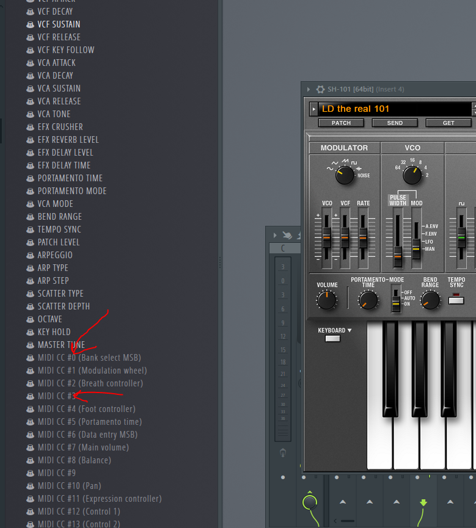

# Как переопределить постоянные ссылки для VST вручную через XML (How to override generic link manually via XML)

## Пример файла с постоянными ссылками

```xml
<?xml version="1.0"?>
<flcontrolmap version="1">
  <link>
    <ctrlparam>13</ctrlparam>
    <window><![CDATA[Fruity Wrapper - SH-101]]></window>
    <windowparam>0</windowparam>
    <windowid>3</windowid>
    <channel>0</channel>
    <smoothing>0</smoothing>
    <smoothspeed>469</smoothspeed>
  </link>
</flcontrolmap>
```

`ctrlparam` - это айдишник контрола миди-контроллера
`window` - это имя VST-плагина
`windowparam` - это айдишник контрола у вст-плагина
`windowid` - это айдишник плагина внутри студии

## Айдишники контролов на Korg Nanokontrol (v1)


## Айдишники VST (SH-101)


## SH-101 VST MIDI-CC
- CC3 = VCF_FREQ
- CC5 = PORTAMENTO_TIME
- CC9 = VCF_RES
- CC12 = EFFECTS_CRUSHER
- CC13 = EFFECTS_TIME

1 to 5 == FROM LEFT TO RIGHT
- CC16 = SOURCE_MIXER_1
- CC17 = SOURCE_MIXER_2
- CC18 = SOURCE_MIXER_3
- CC19 = SOURCE_MIXER_5

- CC26 = MODULATOR_VCO
- CC28 = MODULATOR_VCF
- CC29 = MODULATOR_RATE
- CC35 = MODULATOR_WAVEFORM
- CC41 = BEND_RANGE
- CC47 = VCO_DIGITS
- CC50 = VCO_PULSEWIDTH
- CC60 = VCO_MOD
- CC69 = VCA_TONE
